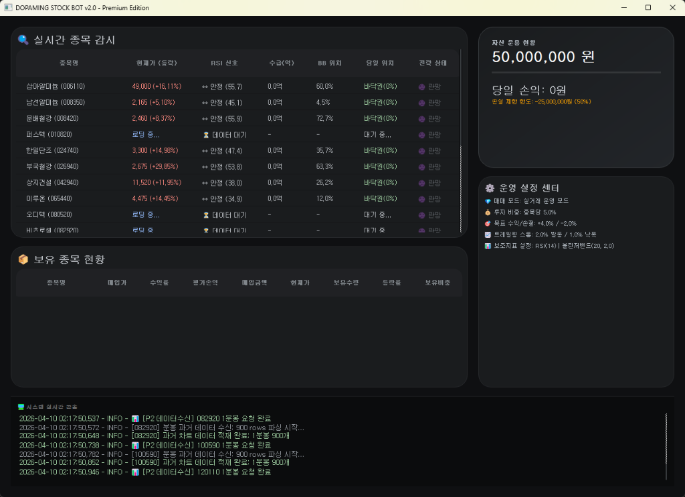

# 📈 DOPAMING-STOCK-BOT v2.6
**Dopaming-Stock-Bot**은 키움증권 OpenAPI+ 기반의 **하이엔드 자율주행 주식 트레이딩 데스크톱 플랫폼**입니다. 단순한 자동화를 넘어, **초저지연 병렬 연산 엔진**과 **이중 다이버전스 필터링**을 통해 압도적인 시장 진입 속도와 안정성을 제공합니다.

---

## 📸 visual Preview (미리보기)

### 💎 프리미엄 대시보드 UI

> 사용자의 모든 자산과 감시 상태는 세련된 **파스텔 톤 다크 모드** 대시보드에 실시간으로 시각화됩니다.
- **실시간 리스크 보드**: 손실제한 한도 대비 현재 손익 상태를 다이내믹한 위젯으로 표시.
- **초정밀 감시 테이블**: 각 종목별 RSI 흐름, 캔들 데이터 로딩 상태, 진입 시그널 강도를 직관적인 아이콘으로 확인.

### 📊 슬랙(Slack) 수익 리포트 샘플
> 매일 장 종료 시(15:30) 전용 AI 엔진이 생성한 상세 성과 리포트가 스마트폰으로 즉시 전송됩니다.
```markdown
🔔 [DOPAMING] 금일 매매 성과 요약 (2026-04-10)
--------------------------------------
✅ 총 거래수: 12건 | 승률: 75.0%
💰 당일 실현 손익: +1,245,000원
📈 최고 수익 종목: 삼성전자 (+4.2%)
📉 최대 손실 종목: 카카오 (-2.1%)
--------------------------------------
🚀 오늘도 성공적인 트레이딩을 마쳤습니다.
```

---

## 📉 전략 딥다이브 (Strategy Deep-Dive)

### Stefano RSI 이중 다이버전스 전략
우리 봇은 단순히 지표가 낮을 때 사는 것이 아니라, **가격과 지표의 괴리(Divergence)**를 두 단계로 필터링하여 승률을 극대화합니다.

1. **거시적 필터 (5분봉)**: 5분봉 기준에서 가격은 전저점을 경신하지만, RSI 저점은 높아지는 '거시적 상승 다이버전스'를 먼저 확인하여 추세 전환 가능성을 감지합니다.
2. **미시적 타격 (1분봉)**: 거시 필터가 활성화된 상태에서, 1분봉에서도 동일한 다이버전스가 이중으로 포착될 때를 **최종 진입 타점**으로 결정합니다.
3. **연산 최적화 (Indicators Caching)**: 모든 지표는 캔들이 새로 생성될 때만 증분 계산되도록 설계되어, 0.5초의 초고속 주기 분석 중에도 CPU 점유율을 5% 미만으로 유지합니다.

---

## 🚀 설치 및 가동 가이드 (Installation & Setup)

> [!IMPORTANT]
> **필수 요구사항**: 본 프로그램은 반드시 **Windows 10/11 64bit** 환경에 설치된 **Python 3.10.x 32-bit** 환경에서 구동되어야 합니다. (키움 API 32비트 제약)

### 1단계: 키움 OpenAPI+ 상세 설정
1. **모듈 설치**: 키움증권 홈페이지 내 [오픈API 서비스 시작하기] 메뉴를 통해 설치.
2. **모의투자 신청**: HTS 또는 홈페이지에서 반드시 상시모의투자를 신청하고 전용 비밀번호(`0000` 등)를 확인하세요.
3. **로그인 자동화**: 처음 로그인 시 시스템 트레이의 키움 아이콘 우클릭 > [계좌비밀번호 저장]에서 비밀번호 입력 후 **[자동로그인]**을 체크하면 로그인 창 없이 즉시 가동됩니다.

### 2단계: 영웅문4 대상종목(조건식) 설정
1. HTS 메뉴 검색창에 **[0150]** 입력하여 '조건검색' 창 오픈.
2. 자신만의 전략(RSI, 거래량 등)을 구성한 후 **[내조건식 저장]**을 눌러 이름을 지정 (예: `스캘핑전략A`).
3. 저장 시 반드시 **[서버 저장]**을 확인해야 봇이 실시간으로 종목을 인식합니다.

### 3단계: 환경 구성 및 가동
```bash
# 가상환경 구축 및 패키지 설치
python -m venv venv32
.\venv32\Scripts\activate
pip install -r requirements.txt

# 📌 start_bot.bat 마우스 우클릭 -> [관리자 권한으로 실행]
```

---

## ⚙️ 마스터 설정 가이드 (Configuration Guide)

`.env` 파일의 모든 값은 아래의 정의에 따라 봇의 성격을 결정합니다.

| 환경 변수 | 설명 | 권장 기본값 |
| :--- | :--- | :--- |
| `DRY_RUN_MODE` | 실전/가상 매매 모드 선택 (`False` 시 실제 주문 발송) | `True` |
| `SLACK_WEBHOOK_URL` | 리포트 및 알림 수신용 슬랙 웹훅 주소 | - |
| `TRADE_INVEST_RATE` | 종목당 투자 비중 (총 자산 대비 %, 예: 0.05=5%) | `0.05` |
| `RISK_LOSS_LIMIT_RATE`| 당일 자산 대비 최대 허용 손실 (충족 시 전량 청산) | `0.20` |
| `TRADE_TARGET_PROFIT` | 종목별 목표 익절선 (예: +4.0%) | `0.04` |
| `TRADE_STOP_LOSS` | 종목별 최대 손절선 (예: -2.0%) | `-0.02` |
| `TRAILING_STOP_ACTIVATION`| 트레일링 스톱이 작동하기 시작하는 수익률 | `0.02` |
| `TRAILING_STOP_CALLBACK`| 최고점 대비 몇 % 하락 시 매도할 것인가 | `0.01` |
| `ACCOUNT_PASSWORD` | 키움증권 계좌 비밀번호 (모의투자 시 `0000`) | `0000` |
| `MAX_MONITORED_STOCKS` | **[신규]** 최대 실시간 감시 종목 수 | `20` (권장: 20~30) |
| `INDICATOR_RSI_PERIOD` | RSI 지표 계산 기간 (캔들 개수) | `14` |
| `INDICATOR_BB_PERIOD` | 볼린저밴드 이동평균 기간 | `20` |
| `INDICATOR_BB_STD` | 볼린저밴드 표준편차 배수 | `2.0` |

---

## ⏰ 운영 스케줄 및 가이드 (Operational Guide)

- **운영 시간**: 평일 **09:00 ~ 15:30**. 주말 및 공휴일은 동작하지 않습니다.
- **장 종료 자동화**: 15:30 정각에 모든 포지션을 일괄 정리할지 여부를 선택하고, 당일 최종 수익 리포트를 생성합니다.
- **장중 재접속 주의**: 장중에 봇을 재시작하면, 이전 캔들 데이터를 다시 리샘플링하여 전략 상태를 복구하는 데 약 1~2분의 시간이 소요됩니다.
- **시뮬레이션 모드**: `DRY_RUN_MODE=True` 설정 시, 평일 장중에는 실제 데이터로 매매를 모의 연습할 수 있습니다.

---

## 🏥 고도화된 트러블슈팅 (Advanced Troubleshooting)

- **에러코드 183 (Update Error)**: 다른 키움 관련 프로세스(영웅문 등)가 켜져 있어 업데이트가 안 될 때 발생합니다. `start_bot.bat` 실행 시 기존 고스트 프로세스를 자동으로 정리하여 충돌을 방지합니다.
- **전용 32비트 파이썬 미인식**: 반드시 `python --version`을 쳐서 아키텍처를 확인하세요. 64비트이면 키움 OCX를 로딩할 수 없습니다.
- **로그인 루프 현상**: 키움 OpenAPI 모듈이 관리자 권한으로 실행되지 않았을 때 발생합니다. 반드시 배치를 **[관리자 권한]**으로 실행하세요.
- **종목 데이터 수신 불가**: 영웅문 HTS에서 저장한 조건검색식 이름이 봇 설정과 일치하는지, 서버 저상 상태인지 확인하세요.

---

## ⚠️ 면책 조항
본 프로그램은 교육용 소스코드입니다. 실제 가동으로 인해 발생하는 모든 손실에 대해 개발자는 책임을 지지 않습니다. 반드시 모의투자를 통해 충분히 검증하십시오.
